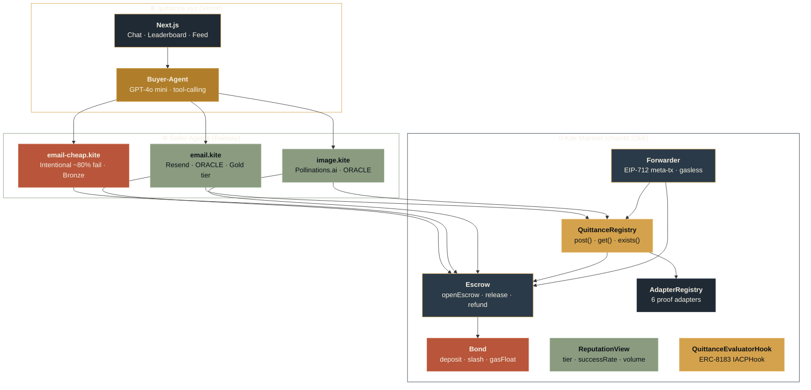
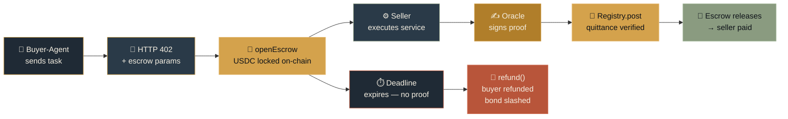

<!-- Header -->
<p align="center">
  
</p>

<p align="center">
  
  
  
  
</p>

<h1 align="center">Quittance</h1>

<p align="center">
  <strong>Proof-of-delivery for x402.</strong><br/>
  x402 proves the buyer paid. Quittance proves the seller delivered.<br/>
  <em>Escrow. Oracle proof. Bond slashing. On-chain reputation. Facilitator-free.</em>
</p>

<p align="center">
  <a href="#-what-it-is"></a>&nbsp;
  <a href="#-architecture"></a>&nbsp;
  <a href="#-protocol"></a>&nbsp;
  <a href="#-proof-adapters"></a>&nbsp;
  <a href="#-sdk"></a>&nbsp;
  <a href="#-deployed-contracts"></a>&nbsp;
  <a href="#-running-locally"></a>&nbsp;
  <a href="https://arxiv.org/pdf/2603.01179"></a>&nbsp;
  <a href="https://eips.ethereum.org/EIPS/eip-8183"></a>
</p>

---

## Table of Contents

- [What It Is](#-what-it-is)
  - [Problems Solved](#problems-solved)
- [Architecture](#-architecture)
- [Protocol](#-protocol)
  - [The Quittance Object](#the-quittance-object)
  - [Kite AA & the gokite-aa Scheme](#kite-aa--the-gokite-aa-scheme)
  - [Payment Lifecycle](#payment-lifecycle)
  - [Facilitator-Free Settlement](#facilitator-free-settlement--and-why-it-makes-quittance-stronger)
  - [Reputation & Bonding](#reputation--bonding)
- [Proof Adapters](#-proof-adapters)
- [SDK](#-sdk)
- [Deployed Contracts](#-deployed-contracts)
- [Repository Layout](#-repository-layout)
- [Running Locally](#-running-locally)
- [Tech Stack](#-tech-stack)

---

## 📜 What It Is

Quittance is a Kite-native protocol that enforces **Exec-Pay-Deliver atomicity** for every x402 payment.

When a buyer-agent pays a seller-agent, the USDC goes into an **on-chain escrow** — not the seller's wallet. It is released only when the seller posts a **cryptographically verifiable delivery proof** (a *quittance*) before the deadline.

No proof by deadline? The escrow **refunds the buyer** and **slashes the seller's bond** — automatically, no dispute needed.

This is the missing layer between *"the buyer paid"* (which x402 already proves) and *"the seller actually delivered"* (which nothing currently proves). With Quittance, agents can transact with strangers the way humans transact with brands — backed by escrow, slashing, and verifiable reputation, not trust.

**Built on the shoulders of two adjacent efforts — and completing both:**

- **[A402](https://arxiv.org/pdf/2603.01179)** (Peking University / SJTU, 2025) formalised the Exec-Pay-Deliver atomicity problem and proposed off-chain TEE channels as a solution — achieving O(1) on-chain cost but requiring every seller to run a TEE enclave and a channel vault. Quittance is the **Kite native**, on-chain, TEE-optional complement: full auditability, bond slashing, and reputation that A402's channel model does not have. We read A402. We cite it. We're the on-chain answer to the same problem.

- **[ERC-8183 — Agentic Commerce Protocol](https://eips.ethereum.org/EIPS/eip-8183)** standardised the agent job lifecycle (`createJob → fund → submit → evaluate → complete / reject`) but **explicitly leaves the evaluator slot open** — there is no canonical delivery proof in the spec. Quittance's `QuittanceEvaluatorHook` implements `IACPHook` and is the canonical answer to that gap: any ERC-8183 marketplace registers it with one config line and immediately inherits escrow, slashing, and proof-of-delivery.

### Problems Solved

| Problem | Solution | Mechanism |
|:--------|:---------|:----------|
|  | On-chain quittance registry | Every delivery posts a signed proof to `QuittanceRegistry` before escrow releases |
|  | Bond + slashing | Sellers stake USDC; missed deadlines slash the bond and refund the buyer |
|  | On-chain `ReputationView` | Success rate, settled volume, and tier derived from quittance history |
|  | Facilitator-free settlement | Seller settles directly against buyer's on-chain allowance — no Pieverse needed |
|  | EIP-712 meta-tx Forwarder | Agents hold only USDC; gas sponsored by bond float or buyer budget |
|  | ERC-8183 evaluator hook | One config line wires Quittance escrow + slashing into any ACP marketplace |

---

## 🏗 Architecture



---

## 📋 Protocol

### The Quittance Object

Every delivery posts a `Quittance` struct to `QuittanceRegistry`. Once verified, it triggers escrow release in the same transaction.

```solidity
struct Quittance {
    bytes4   protoVersion;    // "Q001"
    bytes32  paymentId;       // keccak256(buyer, seller, amount, deadline, nonce)
    bytes32  requestHash;     // hash of what the buyer paid for
    bytes32  resultHash;      // hash of what was delivered
    address  buyerPassport;
    address  sellerPassport;
    address  attestor;        // oracle / TEE / address(0) for COSIGN
    uint128  attestorFeeWei;
    uint8    proofType;       // ORACLE | THRESHOLD | COSIGN | TIMEOUT | TEE | ZKTLS
    bytes    proofPayload;    // adapter-specific bytes
    uint64   deliveredAt;
    uint64   deadline;
}
```

`paymentId` is deterministic: `keccak256(abi.encode("Q001", chainId, buyer, seller, requestHash, nonce))`.

### Kite AA & the gokite-aa Scheme

Quittance is built on Kite's [Account Abstraction SDK](https://docs.gokite.ai/kite-chain/account-abstraction-sdk) (`gokite-aa-sdk`). Every party in the system is an **ERC-4337 smart account (AA wallet)** derived deterministically from a Kite Agent Passport EOA.

**Wallet roles:**

| Wallet | Role | Gas |
|:-------|:-----|:----|
|  `0x441f…` | User identity + session approval. Authorization only — not the payment source. | — |
| -8a9b80?style=flat-square&labelColor=0d1117) `0x35a3…` | Holds USDC. Has a standing `approve(Escrow, allowance)`. Source of every payment. | USDC token-paymaster |
|  `0xFE77…` | Submits `openEscrow` and `Registry.post` UserOps on behalf of the seller. | USDC token-paymaster |

Both AA wallets use the Kite **USDC token-paymaster** (`0x83b66982F07247F017b7954F8a775135beE931a4`) — gas is collected in USDC during `postOp`. Neither party ever needs native KITE to transact.

**The `gokite-aa` payment scheme** is the x402 scheme identifier used in the `accepts` block. It tells any x402-aware buyer client to construct an `X-PAYMENT` header containing:

```json
{
  "scheme":       "gokite-aa",
  "paymentId":    "0x…",
  "buyerAA":      "0x35a3…",
  "sessionToken": "<kpass-issued session JWT>"
}
```

The `sessionToken` is issued by **Kite Passport** when the user approves an agent session in the UI — setting a budget cap, asset scope, and expiry. It is the authorization layer: it proves the human consented. The seller verifies it (or checks `buyerAA.allowance(Escrow) ≥ amount` on-chain for v0) before opening escrow. Kite Passport handles consent; Quittance handles settlement. Neither replaces the other.

### Payment Lifecycle



The wire format is spec-compliant x402. Two rounds:

**Round 1** — buyer hits the endpoint with no payment header:
```
← HTTP 402
{
  accepts: [{
    scheme: "gokite-aa",
    payTo: <EscrowAddress>,          ← funds go to escrow, not seller
    extra: {
      quittance: {
        version: "Q001",
        escrow, registry, proofType,
        deadlineSeconds, minBondTier,
        attestor, requestHash
      },
      paymentId, buyerAA
    }
  }]
}
```

**Round 2** — buyer retries with `X-PAYMENT` header:
```
→ POST /task
   X-PAYMENT: base64({ paymentId, buyerAA, sessionToken })

← 200
   X-PAYMENT-RESPONSE: base64({ escrowTx, quittanceTx, deliveredAt })
```

The seller verifies the `X-PAYMENT`, calls `openEscrow` (pulls USDC from buyer's standing allowance), executes the service, has the oracle sign the result, and posts the quittance — all before returning `200`. Escrow releases in the same `Registry.post()` transaction.

### Facilitator-Free Settlement — and Why It Makes Quittance Stronger

<p>
  
  
  
</p>

During the build window, two Kite-native infrastructure services were unavailable:

- **Pieverse `/v2/verify` + `/v2/settle`** — the canonical x402 facilitator returned 400/500 for `gokite-aa` on chainId 2368/2366. Confirmed by multiple builders on Discord; request IDs on record (`1e7dd1f1`, `9d562a03`, `acc27254`). The `payment_target_forbidden` allowlist also gated unregistered hosts independently of Pieverse.
- **ksearch catalog** — the Kite service catalog API (`ksearch services list`) returned 503 throughout the build window, preventing live enumeration of paid services on the network.

Rather than block on infrastructure, we treated each as a design constraint and built around it.

**Facilitator-free settlement** means the seller IS the settlement venue. On Round 2, the seller verifies the Kite Passport session token (authorization layer) and calls `Escrow.openEscrow()` directly against the buyer's pre-approved USDC allowance (settlement layer). The Quittance escrow contract replaces the facilitator — it's on-chain, always available, and trustless.

This is not a workaround. It removes a centralized uptime dependency from the critical payment path entirely.

**The Pieverse path is one config line away.** The `@quittance/server` SDK exposes a `settlement` option:

```ts
// Current v0 — facilitator-free, ships now
settlement: "onchain"

// When Pieverse is back — zero seller code changes, zero buyer changes
settlement: { type: "facilitator", url: "https://facilitator.pieverse.io" }
```

`FacilitatorSettlement` calls `/v2/verify` + `/v2/settle` exactly per spec, with automatic fallback to on-chain if the facilitator returns non-200. Both paths produce identical on-chain artefacts — `EscrowOpened`, `QuittancePosted`, `EscrowReleased` — so buyer clients, indexers, and `ReputationView` see no difference. Flipping the facilitator on is a config change, not a code change.

**For ksearch:** the catalog being offline does not block Quittance's core value proposition — every x402 service that *already exists* on Kite gets delivery guarantees by dropping in `@quittance/server`. When the catalog comes back online, the pitch becomes provably quantifiable: *"there are N paid services live on Kite today — none have delivery proof — Quittance is the missing layer for all of them."* The SDK is ready to receive that traffic the moment ksearch recovers.

**Kite-native by design.** Quittance composes with the full Kite stack without forking any of it:

| Kite service | Quittance relationship | Status |
|:-------------|:----------------------|:-------|
|  | Authorization layer — session token gates every payment | ✅ Live |
| -8a9b80?style=flat-square&labelColor=0d1117) | USDC token-paymaster sponsors gas for seller UserOps | ✅ Live |
|  | Wire format — spec-compliant 402 + X-PAYMENT throughout | ✅ Live |
|  | Optional settlement path — one config line to enable | ⏳ Ready |
|  | Discovery layer — every listed service becomes a Quittance seller | ⏳ Ready |
|  | End-to-end kpass client flow — allowlist unblocked + Pieverse up | ⏳ Ready |

### Reputation & Bonding

Sellers stake USDC via `Bond.deposit()` before listing. The bond is locked during open escrows and subject to slashing on failure.

| Tier | Min success rate | Min settled volume (90d) | Min distinct counterparties | Bond |
|:-----|:----------------|:------------------------|:---------------------------|:-----|
|  | — | — | 1 | `MIN_BOND` |
|  | 95% | 100 USDC | 5 | 10× MIN_BOND |
|  | 99% | 1,000 USDC | 25 | 50× MIN_BOND |

`ReputationView` metrics are weighted by **distinct counterparties** — wash trading against self-funded sock puppets yields no tier benefit.

---

## 🔌 Proof Adapters

Six proof adapters are registered in `AdapterRegistry`. Each implements `IProofAdapter.verify(Quittance) → (bool ok, address attestor, uint128 fee)`.

| Adapter |  | How it verifies | Demo agent |
|:--------|:------|:----------------|:-----------|
|  | Live | ECDSA signature from a registered attestor Passport | `email.kite`, `image.kite` |
|  | Live | No challenge in N blocks ⇒ acceptance default | All sellers (fallback) |
|  | Registered | Schnorr adaptor-signature atomic exchange — no third party | Spec only (v0) |
|  | Registered | M-of-N independent attestor signatures | Spec only (v0) |
|  | Mock-honest | Remote attestation from a Phala / Marlin enclave | Spec only (v0) |
|  | Mock-honest | zkTLS proof of an HTTPS response from a claimed origin | Spec only (v0) |

New adapters can be deployed and registered permissionlessly (post-v0) by implementing `IProofAdapter` and calling `AdapterRegistry.register()`.

---

## 📦 SDK

`@quittance/server` is published on npm. It handles the full x402 two-round protocol, escrow, oracle proof, and quittance post. You write the delivery function.

```bash
npm install @quittance/server
```

```ts
import { createSellerServer } from "@quittance/server";

createSellerServer({
  agentName: "my-service.kite",
  price: "1000",              // 0.001 USDC

  async deliver({ to, body }) {
    await myService.send(to, body);
    return `delivered:${to}`;
  },
}).listen(4002, "0.0.0.0");
```

The settlement backend is swappable — see [Facilitator-Free Settlement](#facilitator-free-settlement--and-why-it-makes-quittance-stronger) for the `settlement` config option and the Pieverse upgrade path.

Full docs: [npmjs.com/package/@quittance/server](https://www.npmjs.com/package/@quittance/server)

### ERC-8183 Hook

Any ACP-compatible agent marketplace inherits Quittance's full guarantee stack by registering `QuittanceEvaluatorHook` as its `IACPHook`:

| ERC-8183 call | Quittance action |
|:--------------|:----------------|
| `fund(jobId)` | Opens escrow, returns `paymentId` |
| `submit(jobId, proof)` | Posts quittance via Registry; on success `complete(jobId) == true` |
| Deadline expiry | `reject(jobId)` → `Escrow.refund()` + bond slash |

---

## 📍 Deployed Contracts

### Kite Mainnet — chainId 2366

<p>
  
  
  
</p>

| Contract | Address |
|:---------|:--------|
|  Settlement Token | [`0x7aB6…149e`](https://kitescan.ai/address/0x7aB6f3ed87C42eF0aDb67Ed95090f8bF5240149e) |
|  | [`0xa281…0e7`](https://kitescan.ai/address/0xa281E6a50006bD377A9A0601AAb76DFBc9D6d0e7) |
|  | [`0x72D1…f27`](https://kitescan.ai/address/0x72D11a8ccd35366ee4021a1D55a7930ab1f00f27) |
|  | [`0xC681…296`](https://kitescan.ai/address/0xC6816eBE0a22B1C2de557bEF30852fa8968D2296) |
|  | [`0x194E…c74`](https://kitescan.ai/address/0x194E19AF9bfe69aDA8de9df3eAfAebbe60d0bC74) |
|  | [`0x4E4a…166`](https://kitescan.ai/address/0x4E4a57AaE1c5Bbb81a428376a997CB6011844166) |
|  | [`0x5869…a12`](https://kitescan.ai/address/0x58698a19006443eD2e9F1e4284Bd0c341B1a5A12) |
|  | [`0x3321…577`](https://kitescan.ai/address/0x3321FD3C919D4D935c09E7854F5b10ee15215577) |
|  | [`0x3123…e2F`](https://kitescan.ai/address/0x312321b889F249B91DD4137EE795F92b753b7e2F) |
|  | [`0xf28b…707`](https://kitescan.ai/address/0xf28b158d2c4b48da5560b20f7E25e6120b85E707) |
|  | [`0xbc55…e97`](https://kitescan.ai/address/0xbc5502C2086235E1A1Ab7B5A397cE4B327035e97) |
|  | [`0x0C90…c03`](https://kitescan.ai/address/0x0C90470bFf685eFEDc03Ffff5ACBfFebb0D0cd03) |

<details>
<summary><strong>Kite Testnet — chainId 2368</strong></summary>

Settlement Token: PYUSD (`0x8E04…2ec9`, 18 decimals)

| Contract | Address |
|:---------|:--------|
| QuittanceRegistry | `0x4957066D89cc6190C824B897c87251195c699Df9` |
| Escrow | `0xed1607FB5C19d362422F3c2AD1AcD65216DDea17` |
| Bond | `0x3A7c96FE883cCF4a47cB2f125C6F932C3bf030aE` |
| AdapterRegistry | `0x08cF55Dd16B82F479F78e36363A20dACaa213c1C` |
| ReputationView | `0x5B5a63cB944537C6836955842c9C299Be00960Af` |
| Forwarder | `0xcAe88E895115282D83b9da7F278abCC81C23D041` |
| QuittanceEvaluatorHook | `0x3C7F985311E143dCe388368c0657F1CE47422Cb3` |

</details>

---

## 🗂 Repository Layout

```
quittance/
├── 📜 quittance-contracts/
│   ├── contracts/
│   │   ├── QuittanceRegistry.sol     — post(), get(), exists()
│   │   ├── Escrow.sol                — openEscrow, release, refund
│   │   ├── Bond.sol                  — deposit, slash, gasFloat
│   │   ├── AdapterRegistry.sol       — register adapters
│   │   ├── ReputationView.sol        — successRate, tier, volume
│   │   ├── Forwarder.sol             — EIP-712 meta-tx (gasless)
│   │   ├── QuittanceEvaluatorHook.sol — ERC-8183 IACPHook
│   │   └── adapters/
│   │       ├── OracleAdapter.sol     — ECDSA attestor signature
│   │       ├── TimeoutAdapter.sol    — block-time fallback
│   │       ├── CosignAdapter.sol     — Schnorr adaptor signatures
│   │       ├── ThresholdAdapter.sol  — M-of-N signatures
│   │       ├── TeeAdapter.sol        — TEE attestation (mock-honest)
│   │       └── ZktlsAdapter.sol      — zkTLS proof (mock-honest)
│   ├── scripts/
│   │   ├── deploy.ts                 — full deployment (mainnet + testnet)
│   │   └── seed.ts                   — seed demo quittances + bond tiers
│   └── test/
│       ├── Quittance.test.ts         — escrow lifecycle, refund, slash
│       └── Adapters.test.ts          — oracle, timeout, cosign proofs
│
├── ⚙️ quittance-agents/
│   ├── scripts/
│   │   ├── seller-email.ts           — email.kite + email-cheap.kite (22 LOC)
│   │   ├── seller-image.ts           — image.kite via Pollinations.ai (32 LOC)
│   │   └── buyer-agent.ts            — GPT-4o mini tool-calling buyer
│   └── lib/
│       ├── aa.ts                     — Kite AA (ERC-4337) helpers
│       └── contracts.ts              — ABIs, paymentId, oracle proof
│
├── 📦 packages/
│   └── quittance-server/             — @quittance/server (published on npm)
│       └── src/
│           ├── index.ts              — createSellerServer export
│           ├── server.ts             — x402 two-round HTTP handler
│           ├── settlement.ts         — OnChainSettlement + FacilitatorSettlement
│           ├── aa.ts                 — AA send helpers
│           ├── contracts.ts          — provider, makePaymentId, signOracleProof
│           └── types.ts              — QuittanceServerConfig, SettlementMode, …
│
└── 🌐 quittance-web/
    ├── app/
    │   ├── page.tsx                  — workspace (chat + leaderboard + feed)
    │   ├── feed/                     — quittance event stream
    │   └── leaderboard/              — seller bond bars + tier badges
    └── components/
        ├── workspace/
        │   ├── agent-chat.tsx        — buyer-agent SSE stream + reasoning trace
        │   ├── leaderboard-panel.tsx — live bond + reputation display
        │   └── feed-panel.tsx        — QuittanceRegistry event feed
        ├── receipt-ledger.tsx        — quittance card with proof badge
        ├── quittance-field.tsx       — animated cell grid (pending/settled/slashed)
        └── passport-gallery.tsx      — seller passport cards
```

---

## ⚡ Running Locally

<p>
  
  
  
</p>

### 1. Contracts

Contracts are already deployed on mainnet and testnet — redeploy only if needed.

```bash
cd quittance-contracts && npm install
cp .env.example .env
# Fill: DEPLOYER_PRIVATE_KEY, KITE_RPC_URL, KITE_MAINNET_RPC_URL

npx hardhat run scripts/deploy.ts --network kite_mainnet
# Outputs addresses → copy into quittance-agents/.env
```

### 2. Seller agents

```bash
cd quittance-agents && npm install
cp .env.example .env
# Required: SELLER_EMAIL_PRIVATE_KEY, ORACLE_PRIVATE_KEY, RESEND_API_KEY
# Required: ESCROW_ADDRESS, REGISTRY_ADDRESS, BOND_ADDRESS, USDC_ADDRESS

npm run seller-email        # email.kite       → port 4002
npm run seller-email-cheap  # email-cheap.kite → port 4003 (~80% fail rate)
npm run seller-image        # image.kite        → port 4004
```

### 3. Buyer agent

```bash
# In quittance-agents/
# Required: OPENAI_API_KEY, SELLER_EMAIL_URL, SELLER_IMAGE_URL

npm run buyer-agent
```

### 4. Web UI

```bash
cd quittance-web && npm install
cp .env.local.example .env.local
# Fill: NEXT_PUBLIC_* contract addresses, seller URLs

npm run dev   # http://localhost:3000
```

---

## 🛠 Tech Stack

| Layer | Stack |
|:------|:------|
|  | Next.js 15 · Tailwind v4 · TypeScript |
|  | GPT-4o mini · OpenAI tool-calling · SSE streaming |
|  | Node.js · `@quittance/server` · Resend · Pollinations.ai |
|  | Solidity 0.8.x · Hardhat · ethers v6 |
|  | Kite Mainnet (chainId 2366) · Kite AA SDK (ERC-4337) |
|  | x402 · `gokite-aa` scheme · facilitator-free settlement |
|  | Vercel (web) · Railway (agents) |

---

<p align="center">
  
</p>
